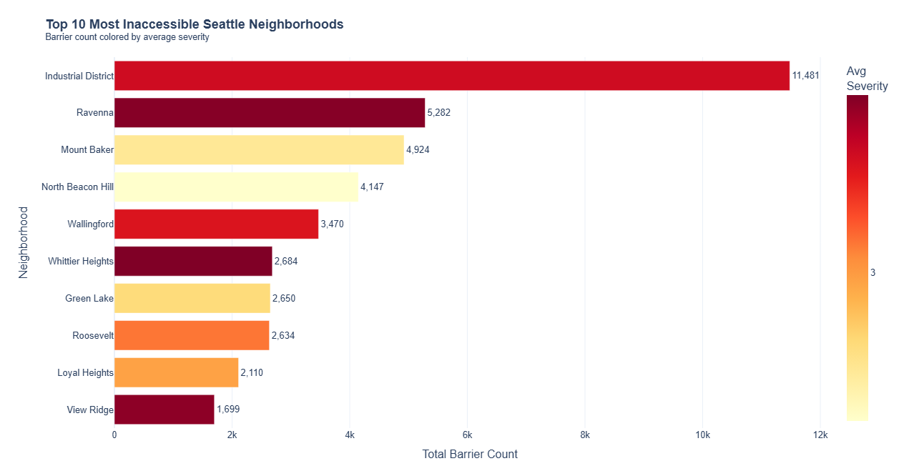
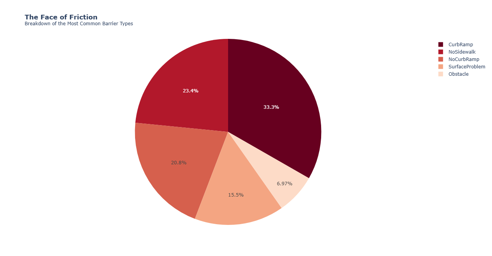
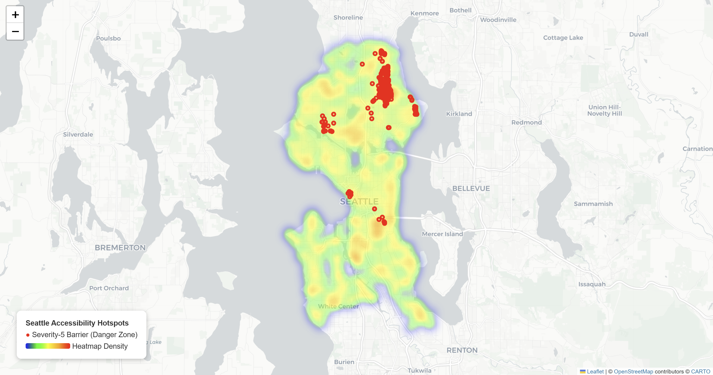

# Where Seattle Stops Moving
### DubsTech Datathon 2026 - Access to Everyday Life Track

**Author:** Daniswara Jati Reksopramudyo
**Links:** [GitHub Repository](https://github.com/djreksopramudyo/DubsTech-Datathon-2026)

---

## 1. Summary
Seattle is famous for being accessible, but the data tells a different story. This project looks at the **Project Sidewalk** dataset to go beyond just counting broken sidewalks.

I created a new score called the **Mobility Friction Index (MFI)** to find out which neighborhoods are actually the hardest to navigate. I found that while the **Industrial District** has the most barriers, residential areas like **Ravenna** are surprisingly difficult because their barriers are more severe. I also found that **99%** of these issues are permanent.

## 2. Methodology & Process

I used Python (Pandas, Plotly, Folium) to clean and analyze the data in three steps:

1.  **Cleaning the Data:**
    - The dataset had about 82,000 rows.
    - I removed some bad data points that were located in the ocean (0,0 coordinates).
    - About 2,000 rows were missing a "severity" score. I filled these in with the **median** (the middle number) instead of the average, so I wouldn't get weird decimals like "3.2 severity."

2.  **Creating the Metric: The Mobility Friction Index (MFI)**

    Just counting barriers isn't enough. A small crack (Severity 1) isn't as bad as a missing curb ramp (Severity 5). So, I made a formula to weight the "quality" of the problem, not just the quantity.

    **Formula:**
    $$\text{MFI} = \text{Total Count} \times \text{Average Severity}$$

    This means a neighborhood only gets a high score if it has **lots of barriers** AND **those barriers are severe**.

3.  **Visualization:**
    - I used **Plotly** to make the bar charts and pie charts.
    - I used **Folium** to make an interactive map that shows exactly where the "danger zones" are.

## 3. Key Findings

### A. The "Top 10" Worst Neighborhoods

| Rank | Neighborhood | Total Barriers | Avg Severity | **Friction Index (MFI)** |
|:---|:---|:---|:---|:---|
| 1 | **Industrial District** | 11,481 | 3.29 | **37,778** |
| 2 | **Ravenna** | 5,282 | 3.41 | **18,051** |
| 3 | **Mount Baker** | 4,924 | 2.76 | **13,594** |
| 4 | Wallingford | 3,470 | 3.25 | **11,286** |
| 5 | North Beacon Hill | 4,147 | 2.64 | **10,966** |

**Insight:** The Industrial District is #1, which makes sense. But **Ravenna (#2)** is a regular residential neighborhood. It ranks high because its barriers are very severe (3.41 average), meaning it's actually quite dangerous for wheelchair users despite looking like a nice area.

### B. Is it just Construction?
No. A lot of people think blocked sidewalks are just temporary construction. My analysis proves that is wrong:
* **Permanent Barriers:** **99.1%**
* **Temporary Barriers:** **0.9%**

**Conclusion:** This is a long-term infrastructure problem, not a temporary one.

## 4. Visualizations

### A. The Accessibility Gap (Bar Chart)

*Figure 1: Top 10 neighborhoods ranked by my MFI score. The color shows severity (Red = More Severe).*

### B. The Face of Friction (Barrier Types)

*Figure 2: What are the actual problems? This chart breaks down the most common types of barriers.*

### C. Hotspot Analysis (Geospatial Map)

*Figure 3: Interactive map of Seattle. The heatmap shows density, and the red dots show the specific "Severity 5" (Critical) failures. Note the massive cluster in SODO and the scattered problems in North Seattle.*

## 5. How to Run the Code
1. Clone this repository.
2. Install libraries: `pip install pandas plotly folium`
3. Run the script: `python seattle_sidewalk_analysis.py`
4. Open the generated HTML files in your browser to see the interactive charts.
